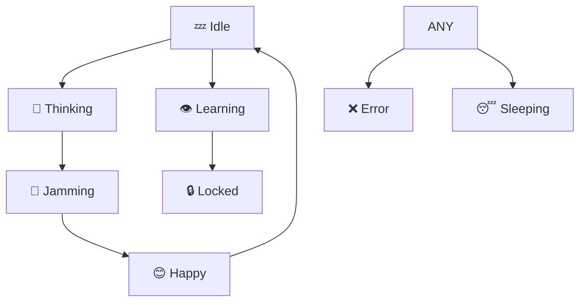

# 🎵 Bass Clef Avatar - Design & Animation

**The Face of DAIW: An Expressive Musical Character**

---

## 🎨 Design Concept

The DAIW avatar is built around the **bass clef symbol (𝄢)**, which naturally forms a face:

```
     ╭─╮  ╭─╮      ← Eyebrows (curved lines)
     ● ●  ● ●       ← Eyes (the two dots)
        ╱            ← Bass clef curve
       ╱
      ╱ ○            ← Main body
     ╱
```

### **Visual Elements:**

1. **Eyes** - The two dots in the bass clef
   - Blink automatically
   - Pupils track mouse movement
   - Change size based on emotion

2. **Eyebrows** - Curved lines above the dots
   - Raise/lower with emotions
   - Furrow when concentrating
   - Asymmetric when confused

3. **Body** - The main bass clef curve
   - Color changes with theme
   - Provides musical context
   - Always recognizable

---

## 😊 Expression States

### **1. 💤 IDLE (Neutral)**
```
     ╭──╮  ╭──╮
     ● ●  ● ●     Calm, relaxed
        ╱          Moderate blinking
```
- **Eyes**: Normal size (1.0x)
- **Eyebrows**: Neutral position
- **Pupil**: Medium size
- **Blink**: Normal speed

### **2. 🤔 THINKING (Curious)**
```
     ╭──╮  ╭──╮
    ╱   ╲╱   ╲    Raised eyebrows
     ● ●  ● ●     Slightly wider eyes
```
- **Eyes**: 10% larger
- **Eyebrows**: Raised 15°, -5px offset
- **Animation**: Gentle eyebrow wave
- **Blink**: Slower

### **3. 🎸 JAMMING (Excited)**
```
     ╭──╮  ╭──╮
    ╱   ╲╱   ╲    Very raised brows
     ●●●  ●●●     Wide eyes!
```
- **Eyes**: 30% larger
- **Eyebrows**: Raised 20°, -8px offset
- **Animation**: Bouncing eyebrows
- **Blink**: Fast, energetic

### **4. 👁️ LEARNING (Focused)**
```
     ╭──╮  ╭──╮
    ╱    ╲╱    ╲   Slight frown
     ● ●  ● ●      Squinting slightly
```
- **Eyes**: 10% smaller (squint)
- **Eyebrows**: Slightly furrowed (-5°)
- **Pupil**: Larger (concentrated)
- **Blink**: Slower focus

### **5. 🔒 LOCKED (Intense)**
```
     ╰──╯  ╰──╯
    ╱    ╲╱    ╲   Furrowed brows
     ● ●  ● ●      Small pupils
```
- **Eyes**: 15% smaller
- **Eyebrows**: Furrowed -15°, +5px down
- **Pupil**: Very small (intense)
- **Blink**: Infrequent

### **6. 😊 HAPPY (Joyful)**
```
     ╭──╮  ╭──╮
    ╱   ╲╱   ╲    Very raised!
     ● ●  ● ●     Bright eyes
```
- **Eyes**: 20% larger
- **Eyebrows**: Raised 25°, -10px up
- **Pupil**: Normal
- **Blink**: Quick, cheerful

### **7. ❌ ERROR (Confused)**
```
     ╭──╮  ╰──╯
    ╱   ╲ ╲    ╱  Asymmetric!
     ● ●  ● ●     One up, one down
```
- **Eyes**: Normal size
- **Eyebrows**: ASYMMETRIC
  - Left: +15°, -5px
  - Right: -10°, +3px
- **Blink**: Rapid confusion

### **8. 😴 SLEEPING (Resting)**
```
     ─────  ─────
     ─ ─    ─ ─    Closed eyes
        ╱          Droopy brows
```
- **Eyes**: Nearly closed (0.1x)
- **Eyebrows**: Relaxed, slightly down
- **Animation**: Gentle breathing motion
- **Blink**: Very slow

---

## 🎬 Animations

### **Automatic Blinking**
```python
# Random blink intervals (2-4 seconds)
next_blink = random.randint(120, 240)  # frames @ 60fps

# Quick blink (5 frames ~ 83ms)
eyes_closed_duration = 5
```

### **Pupil Tracking**
```python
# Pupils follow mouse cursor
max_offset = 3px  # Maximum pupil movement
smooth_factor = 0.1  # Smooth interpolation

# Updates 60 times per second
```

### **State-Specific Animations**

**THINKING:**
```python
# Eyebrow wave (pondering)
offset = sin(time * 0.05) * 2
left_brow_y = -5 + offset
right_brow_y = -5 - offset
```

**JAMMING:**
```python
# Excited eyebrow bounce
bounce = abs(sin(time * 0.15)) * 5
both_brows_y = -8 - bounce
```

**SLEEPING:**
```python
# Gentle breathing
breath = sin(time * 0.03) * 1
eyes_y_offset = breath
```

---

## 🎨 Customization

### **Color Themes**
```python
# Change avatar color
avatar.set_color(QColor(100, 200, 255))  # Blue
avatar.set_color(QColor(147, 112, 219))  # Purple
avatar.set_color(QColor(255, 105, 180))  # Pink
```

### **Expression Parameters**
```python
class EyeExpression:
    size: float = 1.0           # Eye size multiplier
    y_offset: int = 0           # Vertical position
    blink_speed: float = 1.0    # Blink frequency
    pupil_size: float = 0.6     # Pupil size (0-1)
    is_closed: bool = False     # Currently blinking

class BrowExpression:
    angle: int = 0              # Rotation angle (degrees)
    y_offset: int = 0           # Vertical position
    curve: float = 1.0          # Curvature amount
```

---

## 💻 Usage

### **Basic Setup**
```python
from daiw.gui.bass_clef_widget_v3 import BassClefWidget, AvatarState

# Create avatar
avatar = BassClefWidget()

# Set state
avatar.set_state(AvatarState.JAMMING)

# Change color
avatar.set_color(QColor(255, 105, 180))
```

### **Responding to State Changes**
```python
def on_state_changed(state_name: str):
    print(f"Avatar is now: {state_name}")

avatar.state_changed.connect(on_state_changed)
```

### **Integration Example**
```python
class MusicApp(QMainWindow):
    def __init__(self):
        self.avatar = BassClefWidget()

    def start_jam_session(self):
        # Avatar gets excited!
        self.avatar.set_state(AvatarState.JAMMING)

    def on_error(self):
        # Avatar shows confusion
        self.avatar.set_state(AvatarState.ERROR)

    def on_idle(self):
        # Avatar relaxes
        self.avatar.set_state(AvatarState.IDLE)
```

---

## 🎯 Design Philosophy

### **Why This Design?**

1. **Musical Identity**
   - Bass clef is instantly recognizable to musicians
   - Connects DAIW to music production
   - Unique, memorable character

2. **Expressive Range**
   - Eyes and eyebrows provide rich emotional range
   - Animations feel alive and engaging
   - Subtle enough for professional use

3. **Performance**
   - 60 FPS animation
   - Minimal CPU usage
   - Smooth, professional appearance

4. **Accessibility**
   - Simple, clear design
   - High contrast options
   - Works at any size

---

## 🔧 Technical Details

### **Rendering Pipeline**
```python
paintEvent():
    1. Center and scale to widget size
    2. Draw bass clef body (main curve)
    3. Draw eyebrows (with animation)
    4. Draw eyes (with pupils)
    5. Apply real-time transformations
```

### **Animation Loop**
```
60 FPS timer → _update_animation()
    ↓
Update blink state
Update pupil tracking
Apply state animations
    ↓
trigger repaint → paintEvent()
```

### **Performance**
- **FPS**: 60 (16ms per frame)
- **CPU**: <1% on modern hardware
- **Memory**: ~2MB for widget
- **Latency**: <16ms response to state changes

---

## 🎨 Visual Examples

### **Expression Comparison**
```
IDLE        THINKING      JAMMING       LEARNING
 ╭─╮  ╭─╮   ╭──╮  ╭──╮   ╭──╮  ╭──╮    ╭─╮  ╭─╮
 ● ●  ● ●   ● ●●  ●●● ●   ●●●  ●●● ●   ● ●  ● ●
    ╱          ╱            ╱             ╱

LOCKED       HAPPY        ERROR         SLEEPING
 ╰─╯  ╰─╯   ╭──╮  ╭──╮   ╭──╮  ╰──╯    ─ ─  ─ ─
 ● ●  ● ●   ● ●●  ●●● ●   ● ●●  ●● ●    ─ ─  ─ ─
    ╱          ╱            ╱             ╱
```

---

## 🚀 Try It Now!

```bash
# Run the demo
python demo_bass_clef_avatar.py

# Features to try:
# - Move mouse over avatar (pupil tracking)
# - Click different expression buttons
# - Change colors
# - Enable auto-cycle to see all states
```

---

## 📊 State Transitions



---

## 🎭 Future Enhancements

- [ ] Mouth animations for speaking
- [ ] Ear wiggle when listening to music
- [ ] Sweat drops when processing
- [ ] Hearts/stars for achievements
- [ ] Customizable accessories (hat, glasses)
- [ ] Multiple bass clef characters

---

**"A face that feels the music."** 🎵

The bass clef avatar makes DAIW feel alive and responsive, creating
an emotional connection between user and AI assistant.
